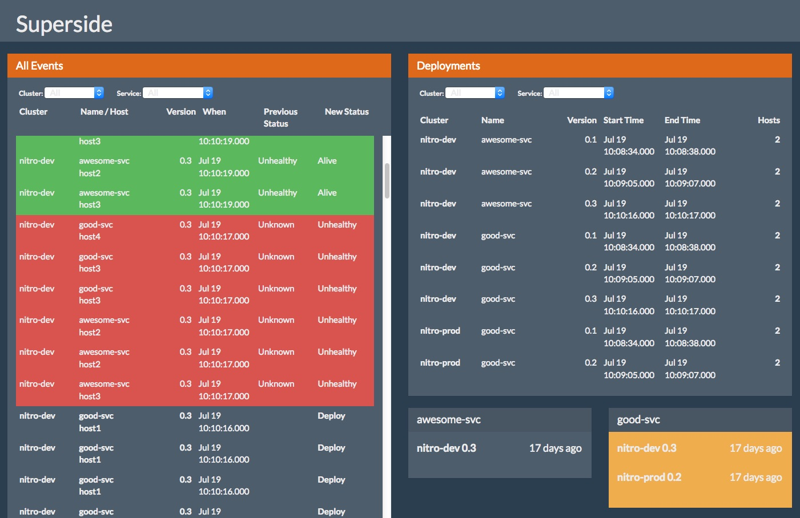
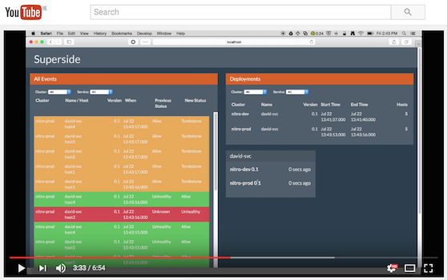

Superside
=========

Find out what's going on in your services environment!

SuperSide is a multi-environment console for
[Sidecar](https://github.com/newrelic/sidecar)-based infrastructures. It can be
subscribed to state updates from Sidecar in multiple environments. Sidecar
focuses on current state of the system, while Superside tracks history and adds
the abstraction of Deplpoyments. These are then tracked and compared for each
service between multiple environments.

From the Superside console, you can see an ongoing stream of events in all of
your environments, the most recent deployments tracked by environment and a
little state panel showing the currently deployed versions of each of your
services

I recently did a short Youtube video on Superside and what it's for:

